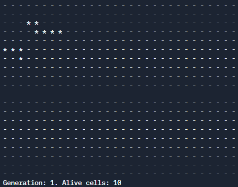
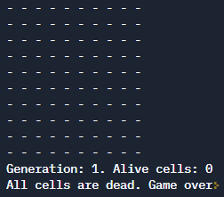
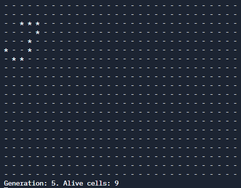
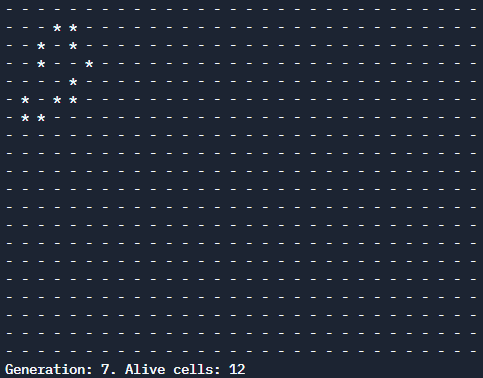
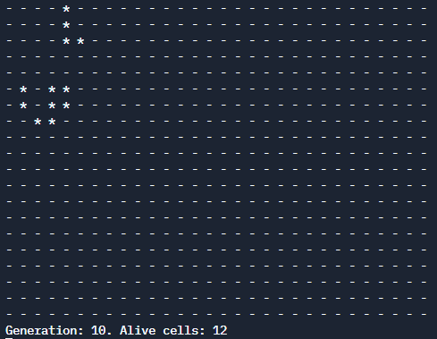

# Курсовой проект «Игра "Жизнь"»

Курсовой проект представляет собой упрощённую консольную реализацию игры "Жизнь", придуманной английским математиком Джоном Конвеем в 1970 году.

## Содержание

### 1. Правила игры
Место действия этой игры — «вселенная» — это размеченная на клетки ограниченная плоскость.

Каждая клетка на этой плоскости может находиться в двух состояниях: быть «живой» (заполненной) или быть «мёртвой» (пустой). Клетка имеет восемь соседей, окружающих её

Распределение живых клеток в начале игры называется первым поколением. Каждое следующее поколение рассчитывается на основе предыдущего по таким правилам:
-   в пустой (мёртвой) клетке, рядом с которой ровно три живые клетки, зарождается жизнь;
-   если у живой клетки есть две или три живые соседки, то эта клетка продолжает жить; в противном случае, если соседей меньше двух или больше трёх, клетка умирает («от одиночества» или «от перенаселённости»)

Игра прекращается, если
-   на поле не останется ни одной «живой» клетки
-   при очередном шаге ни одна из клеток не меняет своего состояния (складывается стабильная конфигурация)
  
Игрок не принимает прямого участия в игре, а лишь расставляет или генерирует начальную конфигурацию «живых» клеток, которые затем взаимодействуют согласно правилам уже без его участия (он является наблюдателем).

### 2. Требования к решению

Реализация должна удовлетворять следующим требованиям и ограничениям:
1. Текущее состояние вселенной выводится на консоль в виде таблицы из символов, разделённых пробелом. Мёртвая клетка помечается символом `-`, живая клетка помечается символом `*` (примеры далее)
2. На каждом шаге на консоль должно выводиться текущее состояние вселенной, а также информация о номере поколения и количестве живых клеток на текущий момент
3. При завершении игры на консоли должно присутствовать состояние вселенной на момент окончания игры, номер поколения, количество живых клеток, а также причина завершения игры
4. При расчёте состояния клеток на границах игрового поля учитываются только соседние клетки (у клеток на границе игрового поля соседних клеток будет меньше 8)
5. Для инициализации вселенной использовать текстовый файл. Файл имеет следующую структуру: первые два числа - это количество строк и количество столбцов в сетке вселенной. Затем идёт информация о распределении живых клеток. Распределение состоит из неопределённого количества пар чисел, где каждая пара состоит из номера строки и номера столбца живой клетки.

Примеры входного файла, соответствующее ему начальное состояние вселенной и конечное состояние:
##### Пример 1
```
20 30
2 3
2 4
3 4
3 5
3 6
3 7
5 0
5 1
5 2
6 2
```  


##### Пример 2
```
10 10
```  

##### Пример 3
```
3 3
0 0
0 1
0 2
1 0
1 1
1 2
2 0
2 1
2 2
```  


### 3. Дополнительный материал
1. При выводе на консоль каждого следующего состояния у вас никуда не денутся те состояния, которые вы выводили ранее. Это может быть полезно для сохранения истории развития вашей вселенной, но при этом может выглядеть не совсем эстетично.
Альтернативный вариант - очищать консоль перед каждым выводом следующего состояния. Для этого можно использовать функцию `std::system` с аргументом `"clear"`, то есть вызвать функцию `std::system("clear");`. Эта функция находится в библиотеке `<cstdlib>`
2. Компьютеры сейчас работают быстро, поэтому без дополнительных действий состояния будут сменять друг друга практически мгновенно. Для комфортного просмотра разумно добавить задержку примерно в 1 секунду перед каждым следующим вычислением нового состояния. Для этого вам необходимо подключить библиотеку `<unistd.h>` и использовать функцию `sleep`, которая принимает на вход количество секунд, на которое надо задержаться. Для задержки на 1 секунду необходимо вызвать `sleep(1);`
### 4. Пример пошаговой работы программы
Входной файл:
```
20 30
2 3
2 4
3 4
3 5
3 6
3 7
5 0
5 1
5 2
6 2
```










______

### Как правильно задавать вопросы преподавателю?

Что поможет решить большинство частых проблем:

1. Попробовать найти ответ сначала самостоятельно в интернете или в материалах курса и только после этого спрашивать у преподавателя. Скилл поиска ответов пригодится вам в профессиональной деятельности.
1. Если вопросов больше одного, то присылайте их в виде нумерованного списка. Так преподавателю будет проще отвечать на каждый из них. 
1. При необходимости прикрепите к вопросу скриншоты и стрелочкой покажите, где не получается. 

Что может стать источником проблем:

1. Вопросы вида «Ничего не работает. Не запускается. Всё сломалось». Преподаватель не сможет ответить на такой вопрос без дополнительных уточнений. Цените своё время и время других.
2. Откладывание выполнения курсового проекта на последний момент.
3. Ожидание моментального ответа на свой вопрос. Руководители — работающие разработчики, которые кроме преподавания занимаются рабочими проектами. Их время ограничено, поэтому постарайтесь задавать правильные вопросы, чтобы получать быстрые ответы :)
